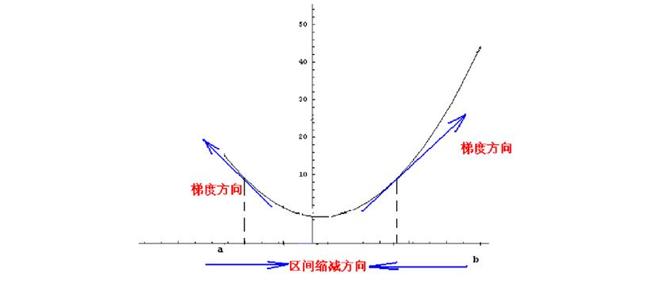
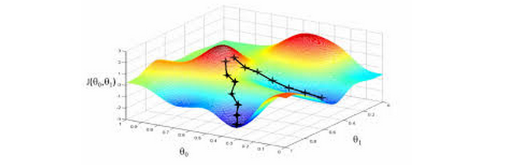

## 梯度下降与Tensorflow

B站视频：https://www.bilibili.com/video/av41787611/

- 梯度下降的概念
- Tensorflow中的使用
- 梯度下降的实现

### 梯度下降

从某点开始梯度下降算法，先求出这一点的梯度，则：

- 梯度的方向表示自变量朝什么方向变化可以使得函数增大最快，相反的方向就可以用来判断**自变量朝什么方向变化可以使得函数变小**（使用误差函数的时候，我们需要误差更小）
- 梯度的大小表示随着自变量的变化，函数变化的快慢
  - 在极小值处，我们找到的梯度会是0，因此梯度较大时，表示我们的点离目标极小值较远，因此自变量的改变应该更加明显
  - 直接用$x=x-\frac{\partial f}{\partial x} * \text{rate}$，这里的rate叫做学习率，更大时可能错过极小值，更小时收敛较慢。



比如一维情况下，两侧梯度较大，自变量沿着梯度方向相反的位置可以使得函数减小。梯度大小更大时应当减小更快。

高维时如下图：



从这个图中也可以看出可能有多个极小值。

### Tensorflow中的梯度下降

直接使用封装好的`GradientDescentOptimizer`函数即可。通过图中的各个operation节点分别求导，就可以算出来整体的导数。

这里示例使用一个一次函数的，相当于权重矩阵W和偏置矩阵b都是`1*1`的。


```python
import tensorflow as tf

# 要学习一个 y = W * x + b
# 随便给个初始值
W = tf.Variable([0], dtype=tf.float32)  # 权重矩阵
b = tf.Variable([0.])                   # 偏置矩阵

x = tf.placeholder(tf.float32)
y = tf.placeholder(tf.float32)
y0 = W * x + b  # 用当前的W和b计算出来的结果

# 输入的x和y都是单个数，但是一次训练我们需要很多个数据
# 要算的是所有训练数据的总的误差
loss = tf.reduce_sum(tf.square(y0 - y))

# 使用自带的最优化函数来做，rate设置成0.01
optimizer = tf.train.GradientDescentOptimizer(0.01)
train = optimizer.minimize(loss)
 
# 输入的训练数据，所以W=[-1], b=[-1]
x_train = [-1, 6, 3, -4]
y_train = [0, -7, -4, 3]

# 开始训练！
init = tf.global_variables_initializer()
with tf.Session() as sess:
    sess.run(init)

    for i in range(301):
        sess.run(train, {x: x_train, y: y_train})
        if i % 20 == 0:
            print(sess.run([W, b, loss], {x: x_train, y: y_train}))
```

    [array([-1.3199999], dtype=float32), array([-0.16], dtype=float32), 7.020799]
    [array([-1.0125163], dtype=float32), array([-0.8176548], dtype=float32), 0.124453574]
    [array([-1.0026603], dtype=float32), array([-0.96124387], dtype=float32), 0.0056221243]
    [array([-1.0005654], dtype=float32), array([-0.99176264], dtype=float32), 0.00025398118]
    [array([-1.0001202], dtype=float32), array([-0.99824923], dtype=float32), 1.1472887e-05]
    [array([-1.0000255], dtype=float32), array([-0.9996279], dtype=float32), 5.182889e-07]
    [array([-1.0000054], dtype=float32), array([-0.99992096], dtype=float32), 2.3391749e-08]
    [array([-1.0000012], dtype=float32), array([-0.9999832], dtype=float32), 1.0536638e-09]
    [array([-1.0000002], dtype=float32), array([-0.9999964], dtype=float32), 4.689582e-11]
    [array([-1.], dtype=float32), array([-0.99999917], dtype=float32), 3.424816e-12]
    [array([-1.], dtype=float32), array([-0.9999997], dtype=float32), 4.2987836e-13]
    [array([-1.], dtype=float32), array([-0.9999997], dtype=float32), 4.2987836e-13]
    [array([-1.], dtype=float32), array([-0.9999997], dtype=float32), 4.2987836e-13]
    [array([-1.], dtype=float32), array([-0.9999997], dtype=float32), 4.2987836e-13]
    [array([-1.], dtype=float32), array([-0.9999997], dtype=float32), 4.2987836e-13]
    [array([-1.], dtype=float32), array([-0.9999997], dtype=float32), 4.2987836e-13]


### 自己用代码实现梯度下降

一维的情况：直接计算导数就行。

直接用近似值$f'(x_0) = \lim\limits_{\Delta x\rightarrow 0} \frac{f(x_0 + \Delta x) - f(x_0)}{\Delta x}$作为导数值，需要估计的函数形式在f()中给出。

我们的目标是使得loss函数最小，这里的loss函数是在找f()的零点。可以看到f()有两个零点，但是梯度下降法只会找到其中一个。这与初始位置有关，所以可以使用随机化的方法设置初始值。


```python
import random

delta = 0.1 ** 5
rate = 0.1 ** 2

def f(x):
    return (x - 5) * (x - 2)

def loss(x):
    return f(x) ** 2

def gradient_descent(x):
    return x - rate * (loss(x + delta) - loss(x)) / delta

x = random.uniform(3, 4)
for i in range(101):
    x = gradient_descent(x)
    if i % 10 == 0:
        print('x:', x, ' loss:', loss(x))
```

    x: 3.1404060517515306  loss: 4.497335374834542
    x: 2.734545510553464  loss: 2.7691603313309496
    x: 2.256233921350491  loss: 0.49427359600138815
    x: 2.0469599656331576  loss: 0.01923066091763706
    x: 2.006781129939205  loss: 0.0004119846941594538
    x: 2.0009344335785335  loss: 7.853600282225536e-06
    x: 2.0001242509936623  loss: 1.3893327572126746e-07
    x: 2.000012767717394  loss: 1.4671189791578906e-09
    x: 1.9999974421906086  loss: 5.888160034981494e-11
    x: 1.9999953356823417  loss: 1.9580334181832246e-10
    x: 1.9999950461460811  loss: 2.2086674727005867e-10


多维的情况类似，只不过需要求的是偏导。


```python
import random

delta = 0.1 ** 5
rate = 0.1 ** 2

def f(x, y):
    return (x - 5) ** 2 + (y - 2) ** 2

def loss(x, y):
    return f(x, y) ** 2

def gradient_descent(x, y):
    return [x - rate * (loss(x + delta, y) - loss(x, y)) / delta, 
            y - rate * (loss(x, y + delta) - loss(x, y)) / delta]

x = random.uniform(3, 4)
y = random.uniform(3, 4)
for i in range(401):
    x, y = gradient_descent(x, y)
    if i % 40 == 0:
        print('x:', x, 'y:', y, ' loss:', loss(x, y))
```

    x: 4.0564372087431435 y: 3.0169561190452976  loss: 3.703740622687112
    x: 4.6530528374398985 y: 2.3739207014549883  loss: 0.0676983285145437
    x: 4.74437775320268 y: 2.2754902337988043  loss: 0.019948060211995945
    x: 4.788091721014593 y: 2.2283750926683337  loss: 0.009420702157131942
    x: 4.815007482064125 y: 2.199365145871457  loss: 0.0054713675560523435
    x: 4.833713069192799 y: 2.1792041670895976  loss: 0.003571912224250021
    x: 4.8476844832034365 y: 2.1641457046372286  loss: 0.002514403587569151
    x: 4.858633327157003 y: 2.152344983861979  loss: 0.0018656810596565532
    x: 4.86751344063672 y: 2.1427739515161632  loss: 0.001439222770615898
    x: 4.874904118205737 y: 2.1348082409164433  loss: 0.001143944017437402
    x: 4.881180252254162 y: 2.128043791101253  loss: 0.000931064216618111


