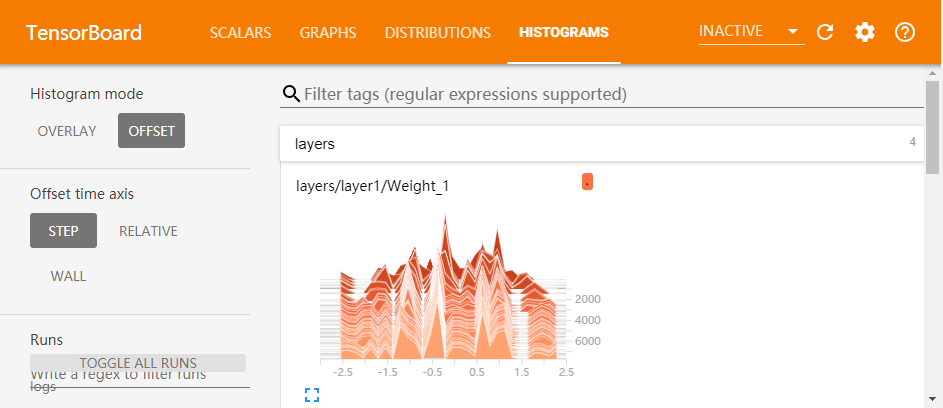

## 神经网络

B站视频：https://www.bilibili.com/video/av43265928/

人工神经网络（Artificial Neural Network，ANN）是模仿自然界中神经网络的形式，构建的各个节点的网络。

### 神经元

ANN中的神经元是接受输入并且给出输出的节点。

#### 激活

上一讲是使用线性的结构，这样每一个神经元都对输出有且仅有线性的影响，无法实现非线性函数的效果。

使用**激活函数**（即一个非线性的函数）来进行非线性的操作，这样就可以避免输出仅仅是输入的线性函数。

- 比如异或操作就不能简单用线性的方法二分类。

激活函数：

- sigmoid：$\frac{1}{1+e^{-t}}$
  - 
  - 会梯度消失（左边和右边梯度为0，这样算出来的梯度就是几乎为0了）
- tanh：$\frac{e^t-e^{-t}}{e^t+e^{-t}}$
  - 
  - 只是sigmoid稍微变了一下，仍然会梯度消失
- ReLU：$\max(0, t)$
  - 
  - 右侧不会有梯度消失，但容易死亡（左侧区间梯度为0）
- Leak ReLU：$\max(\alpha t, t)$
  - $\alpha$是一个很小的常数，这样梯度就不是0了

### 带有激活函数的神经网络

#### 分类问题

使用一个简单的二分类神经网络。实现异或的训练。

sigmoid函数的范围是0~1，需要的结果是0或者1，直接把最后的结果加个sigmoid作为最后的结果。而loss函数直接用这个结果和已知的异或结果差的平方和来表示。

但是异或操作不是简单的一个线性的模型，所以不能直接用线性的方法进行处理，因此：
- 使用多层结构
- 添加激活函数，这里使用relu

最终使用的一个计算架构是：

- 隐藏层：$x (? \times 2\ 矩阵，其中的\ ?\ 指输入一批数据的大小) \times W_1 (2 \times 16\ 矩阵) + b_1 (所有元$$素都相同的一个\ ? \times 16\ 的矩阵)$，之后进行relu处理；
- 输出层：$隐藏层 (? \times 16\ 矩阵) \times W_2 (16 \times 1\ 矩阵) + b_2 (一个\ ? \times 1\ 的矩阵)$，之后进行sigmoid处理；得到的结果是一个$? \times 1$的矩阵，所以输入的$y$也使用一个$? \times 1$的形状。

参考https://blog.csdn.net/sysstc/article/details/75126420


```python
import tensorflow as tf

# 要学习一个两层的网络
# 随便给个初始值
W1 = tf.Variable(tf.random_normal([2, 16]))
W2 = tf.Variable(tf.random_normal([16, 1]))
b1 = tf.Variable(0.)
b2 = tf.Variable(0.)

# 成批地进行计算，所以第一个维度不进行预设
x = tf.placeholder(tf.float32, shape=[None, 2])
y = tf.placeholder(tf.float32, shape=[None, 1])

# 为了添加非线性的因素，在隐藏层上添加一个激活函数
# 如果没有激活函数，相当于就是一个单纯的线性模型
inner = tf.nn.relu(tf.matmul(x, W1) + b1)
y0 = tf.nn.sigmoid(tf.matmul(inner, W2) + b2)  # 用当前的W和b计算出来的结果

loss = tf.reduce_sum(tf.square(y0 - y))

# 使用自带的最优化函数来做，rate设置成0.01
optimizer = tf.train.GradientDescentOptimizer(0.01)
train = optimizer.minimize(loss)
 
x_train = [[0, 0], [1, 1], [0, 1], [1, 0]]
y_train = [[0], [0], [1], [1]]

# 开始训练！
init = tf.global_variables_initializer()
with tf.Session() as sess:
    sess.run(init)
    for i in range(8001):
        sess.run(train, {x: x_train, y: y_train})
        if i % 20 == 0:
            print(sess.run([y0, loss], {x: x_train, y: y_train}))
```

    [array([[0.49988213],
           [0.22910865],
           [0.25100097],
           [0.9626661 ]], dtype=float32), 0.86476624]
    ......
    [array([[0.07287306],
           [0.02749332],
           [0.9675964 ],
           [0.9733778 ]], dtype=float32), 0.007825099]


### 神经网络架构设计

神经网络的创建过程中，有许多共性的地方。

比如一个最简单的深度网络，由多层构成，每一层都只是一个线性处理加上一个激活函数，这样就可以把每一层添加的过程抽取出来作为一个函数，这就是经常看到的add_layer函数。

在添加层之前，我们需要确认的其实只有：
- 输入的大小
- 输出的大小
- 输入的变量
- 使用的激活函数

在函数里面，自行给输入变量乘一个weight加一个bias，之后就可以返回这一层的输出。

参考https://morvanzhou.github.io/tutorials/machine-learning/tensorflow/3-1-add-layer/

这里使用add_layer函数来改写之前的异或的学习函数。


```python
import tensorflow as tf

def add_layer(inputs, in_size, out_size, activation_function=None):
    # 定义需要的weight和bias并且给出初始值
    Weights = tf.Variable(tf.random_normal([in_size, out_size]))
    biases = tf.Variable(tf.zeros([1, out_size]) + 0.1)
    # 线性计算的结果
    Wx_plus_b = tf.matmul(inputs, Weights) + biases
    # 最后加上激活函数，但是需要判断是否是空
    if activation_function is None:
        outputs = Wx_plus_b
    else:
        outputs = activation_function(Wx_plus_b)
    return outputs

# 接下来用add_layer来进行训练操作
x = tf.placeholder(tf.float32, shape=[None, 2])
y = tf.placeholder(tf.float32, shape=[None, 1])

inner = add_layer(x, 2, 16, tf.nn.relu)
y0 = add_layer(inner, 16, 1, tf.nn.sigmoid)

loss = tf.reduce_sum(tf.square(y0 - y))

# 使用自带的最优化函数来做，rate设置成0.01
optimizer = tf.train.GradientDescentOptimizer(0.01)
train = optimizer.minimize(loss)
 
x_train = [[0, 0], [1, 1], [0, 1], [1, 0]]
y_train = [[0], [0], [1], [1]]

# 开始训练！
init = tf.global_variables_initializer()
with tf.Session() as sess:
    sess.run(init)
    for i in range(8001):
        sess.run(train, {x: x_train, y: y_train})
        if i % 20 == 0:
            print(sess.run([y0, loss], {x: x_train, y: y_train}))
```

### 结果可视化

可以使用matplotlib来进行可视化，比如前一讲提到的一个拟合一次函数的示例，在它的基础上画出对应的图。

为了能够看出拟合的结果，可以直接定义一些横轴上的散点，用来连接成线来显示。

*注：在jupyter里面使用matplotlib画图，需要先执行一句`%matplotlib inline`。*


```python
%matplotlib inline
```


```python
import tensorflow as tf
import matplotlib.pyplot as plt

# 要学习一个 y = W * x + b
# 随便给个初始值
W = tf.Variable([0], dtype=tf.float32)  # 权重矩阵
b = tf.Variable([0.])                   # 偏置矩阵

x = tf.placeholder(tf.float32)
y = tf.placeholder(tf.float32)
y0 = W * x + b  # 用当前的W和b计算出来的结果

# 输入的x和y都是单个数，但是一次训练我们需要很多个数据
# 要算的是所有训练数据的总的误差
loss = tf.reduce_sum(tf.square(y0 - y))

# 使用自带的最优化函数来做，rate设置成0.01
optimizer = tf.train.GradientDescentOptimizer(0.01)
train = optimizer.minimize(loss)
 
# 输入的训练数据，所以W=[-1], b=[-1]
x_train = [-1, 6, 3, -4]
y_train = [0, -7, -4, 3]

# 开始训练！
init = tf.global_variables_initializer()
with tf.Session() as sess:
    sess.run(init)

    for i in range(301):
        sess.run(train, {x: x_train, y: y_train})
        if i % 20 == 0:
            print(sess.run([W, b, loss], {x: x_train, y: y_train}))
            plt.clf()
            plt.scatter(x_train, y_train, c='r')
            calculated = sess.run(y0, {x: x_train})
            plt.plot(x_train, calculated, c='b')
            plt.pause(0.1)
```

### 神经网络架构可视化

直接使用Tensorboard即可。

使用Tensorboard的时候，可以定义网络中每个节点和部分的名字，如下：

- 单独一个节点：使用`name='XXX'`来定义在图中显示的名字；
- 可以整体用`with tf.name_scope('XXX')`来定义一部分图的名字；
- 使用`tf.summary.FileWriter('目录', sess.graph)`来记录整个图

之后在终端里面输入`tensorboard --logdir 目录`即可打开可视化工具的服务。接下来会在终端里面显示对应的网址信息，但是不要直接输入，找到其中的端口号，使用localhost对应端口号即可。

比如：

> 如下文代码所示，如果使用目录`C:\logs`就可以直接通过命令：`tensorboard --logdir=C:\logs`启动
>
> 之后会显示一些启动相关信息，如：`TensorBoard 1.12.2 at http://FHAsus:6006 (Press CTRL+C to quit)`
>
> 记住这里的端口号（一般会是6006），在浏览器中打开`http://localhost:6006`即可，这里的6006替换为上面看到的端口号

上面使用的学习异或的神经网络，进行可视化的例子如下所示：


```python
import tensorflow as tf
import os

# 随便给一个记录的目录
path = r'C:\logs'

if not os.path.exists(path):
    os.mkdir(path)

def add_layer(inputs, in_size, out_size, activation_function=None):
    # 定义需要的weight和bias并且给出初始值
    with tf.name_scope('layer'):
        Weights = tf.Variable(tf.random_normal([in_size, out_size]), name='Weight')
        biases = tf.Variable(tf.zeros([1, out_size]) + 0.1, name='bias')
        # 线性计算的结果
        Wx_plus_b = tf.matmul(inputs, Weights) + biases
        # 最后加上激活函数，但是需要判断是否是空
        if activation_function is None:
            outputs = Wx_plus_b
        else:
            outputs = activation_function(Wx_plus_b)
    return outputs

# 接下来用add_layer来进行训练操作
with tf.name_scope('input'):
    x = tf.placeholder(tf.float32, shape=[None, 2], name='x')
    y = tf.placeholder(tf.float32, shape=[None, 1], name='answer')

with tf.name_scope('layers'):
    inner = add_layer(x, 2, 16, tf.nn.relu)
    y0 = add_layer(inner, 16, 1, tf.nn.sigmoid)

with tf.name_scope('loss'):
    loss = tf.reduce_sum(tf.square(y0 - y))

# 使用自带的最优化函数来做，rate设置成0.01
with tf.name_scope('train'):
    train = tf.train.GradientDescentOptimizer(0.01).minimize(loss)

x_train = [[0, 0], [1, 1], [0, 1], [1, 0]]
y_train = [[0], [0], [1], [1]]

# 开始训练！
init = tf.global_variables_initializer()
with tf.Session() as sess:
    sess.run(init)
    tf.summary.FileWriter(path, sess.graph)
    for i in range(8001):
        sess.run(train, {x: x_train, y: y_train})
        if i % 20 == 0:
            print(sess.run([y0, loss], {x: x_train, y: y_train}))
```

得到的结果如图所示：


上面每一块都是一个name_scope，双击可以打开或者隐藏其中的具体内容。

### 训练进度可视化

在上文的基础上，给出训练过程中的loss等数据，可以使用summary进行记录。使用的是`tf.summary.histogram(名字, 节点)`和`tf.summary.scalar('loss', loss)`。前者用于权重、偏置的可视化，后者用于loss函数的可视化。

现在就添加上loss的变化曲线。


```python
import tensorflow as tf
import os

# 随便给一个记录的目录
path = r'C:\logs'

if not os.path.exists(path):
    os.mkdir(path)

def add_layer(inputs, in_size, out_size, layer_index, activation_function=None):
    # 定义需要的weight和bias并且给出初始值
    with tf.name_scope('layer%d' % layer_index):
        Weights = tf.Variable(tf.random_normal([in_size, out_size]), name='Weight')
        biases = tf.Variable(tf.zeros([1, out_size]) + 0.1, name='bias')
        # 线性计算的结果
        Wx_plus_b = tf.matmul(inputs, Weights) + biases
        # 最后加上激活函数，但是需要判断是否是空
        if activation_function is None:
            outputs = Wx_plus_b
        else:
            outputs = activation_function(Wx_plus_b)
    return outputs

# 接下来用add_layer来进行训练操作
with tf.name_scope('inputs'):
    x = tf.placeholder(tf.float32, shape=[None, 2], name='x')
    y = tf.placeholder(tf.float32, shape=[None, 1], name='answer')

with tf.name_scope('layers'):
    inner = add_layer(x, 2, 16, 1, tf.nn.relu)
    y0 = add_layer(inner, 16, 1, 2, tf.nn.sigmoid)

with tf.name_scope('loss'):
    loss = tf.reduce_sum(tf.square(y0 - y))
    loss_scalar = tf.summary.scalar('loss', loss)

# 使用自带的最优化函数来做，rate设置成0.01
with tf.name_scope('train'):
    train = tf.train.GradientDescentOptimizer(0.01).minimize(loss)

x_train = [[0, 0], [1, 1], [0, 1], [1, 0]]
y_train = [[0], [0], [1], [1]]

# 开始训练！
init = tf.global_variables_initializer()
with tf.Session() as sess:
    writer = tf.summary.FileWriter(path, sess.graph)
    sess.run(init)
    for i in range(8001):
        sess.run(train, {x: x_train, y: y_train})
        if i % 20 == 0:
            print(sess.run([y0, loss], {x: x_train, y: y_train}))
            writer.add_summary(sess.run(loss_scalar, {x: x_train, y: y_train}), i)
```

效果如图所示：


如果还需要加上变量的范围数据，就：

- 使用`tf.summary.histogram`
- 使用`tf.summary.merge_all()`

*注：如果运行代码的时候提示merged没有feed，是因为之前已经创建过一些节点并且加入了summary但是没有清空，此次没有在上面加入feed的dict中。这时可以考虑重新启动环境后再运行一次或者像下述代码一样加入`tf.reset_default_graph`*


```python
import tensorflow as tf
import os

# 避免有多余的被summary的节点造成merged出错
tf.reset_default_graph()

# 随便给一个记录的目录
path = r'C:\logs'

if not os.path.exists(path):
    os.mkdir(path)

def add_layer(inputs, in_size, out_size, layer_index, activation_function=None):
    # 定义需要的weight和bias并且给出初始值
    with tf.name_scope('layer%d' % layer_index):
        Weights = tf.Variable(tf.random_normal([in_size, out_size]), name='Weight')
        tf.summary.histogram('Weight', Weights)
        biases = tf.Variable(tf.zeros([1, out_size]) + 0.1, name='bias')
        tf.summary.histogram('bias', biases)
        # 线性计算的结果
        Wx_plus_b = tf.matmul(inputs, Weights) + biases
        # 最后加上激活函数，但是需要判断是否是空
        if activation_function is None:
            outputs = Wx_plus_b
        else:
            outputs = activation_function(Wx_plus_b)
    return outputs

# 接下来用add_layer来进行训练操作
with tf.name_scope('inputs'):
    x = tf.placeholder(tf.float32, shape=[None, 2], name='x')
    y = tf.placeholder(tf.float32, shape=[None, 1], name='answer')

with tf.name_scope('layers'):
    inner = add_layer(x, 2, 16, 1, tf.nn.relu)
    y0 = add_layer(inner, 16, 1, 2, tf.nn.sigmoid)

with tf.name_scope('loss'):
    loss = tf.reduce_sum(tf.square(y0 - y))
    loss_scalar = tf.summary.scalar('loss', loss)

# 使用自带的最优化函数来做，rate设置成0.01
with tf.name_scope('train'):
    train = tf.train.GradientDescentOptimizer(0.01).minimize(loss)

x_train = [[0, 0], [1, 1], [0, 1], [1, 0]]
y_train = [[0], [0], [1], [1]]

# 开始训练！
init = tf.global_variables_initializer()
with tf.Session() as sess:
    writer = tf.summary.FileWriter(path, sess.graph)
    merged = tf.summary.merge_all()
    sess.run(init)
    for i in range(8001):
        sess.run(train, {x: x_train, y: y_train})
        if i % 20 == 0:
            print(sess.run([y0, loss], {x: x_train, y: y_train}))
            writer.add_summary(sess.run(merged, {x: x_train, y: y_train}), i)
```

    [array([[0.55704236],
           [0.85277396],
           [0.8107277 ],
           [0.7797784 ]], dtype=float32), 1.1218412]
    ......
    [array([[0.03657282],
           [0.02884469],
           [0.9725037 ],
           [0.97014636]], dtype=float32), 0.0038168724]


最后的效果如图：




