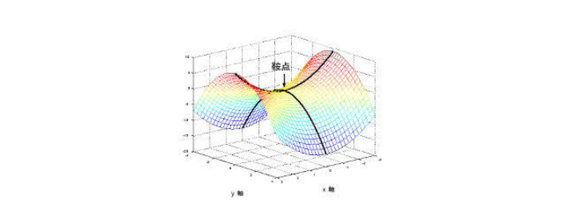

## 优化器

B站视频：https://www.bilibili.com/video/av43268598/

之前一直在使用`GradientDescentOptimizer`，但是梯度下降算法只是优化器的一种，可以使用别的一些更快的算法来进行这一步骤。

- SGD：
  - Stochastic Gradient Descent，随机梯度下降，引入随机因素。
  - 计算梯度的时候，不计算准确的梯度，只是用一部分来算出一个不太准确的梯度。
  - 因此会节省计算资源，同时可以避免陷入鞍点的情况。
    - 
    - 鞍点处梯度为0，无法更新。
  - 也可以避免陷入局部最优无法出来
    - 因为如果进入局部最优，就会有一个随机的扰动，可能让他出来。   
- Momentum：
  - 在梯度下降的基础上，再加上之前一次变量变化的量 的若干倍
  - $w(t+1)=w(t)-\mu\frac{\partial E}{\partial w} + \beta(w(t)-w(t-1)), 0\le \beta < 1$
- AdaGrad：
  - 考虑两个不同方向的变化，将震荡比较大的方向的变化减小
  - 因此相当于降低学习率，除以所有历史变化的平方和开根号
  - $w(t+1)=w(t)-\mu\frac{\partial E}{\partial w} \frac 1{\sqrt{v+\epsilon}}, v=\sum\limits_{i=1}^{t-1}(w(i+1)-w(i))^2$
- RMSProp：
  - 因为AdaGrad里面的平方和开根号会越来越大，所以学习率越来越小，中后期导致训练提前结束
  - 所以采用一种平滑的方法计算学习率的减少量
  - $w(t+1)=w(t)-\mu\frac{\partial E}{\partial w} \frac 1{\sqrt{v(t)+\epsilon}}, v(t)=(1-\beta)v(t-1) + \beta (w(i+1)-w(i))^2$
- Adam：
  - 综合Momentum和RMSProp：
    - $w(t+1)=w(t)-\mu\left(\frac{\partial E}{\partial w} + \beta_0(w(t)-w(t-1))\right) \frac 1{\sqrt{v(t)+\epsilon}},$$ v(t)=(1-\beta)v(t-1) + \beta (w(i)-w(i-1))^2$

### tensorflow中使用

可以使用：

- GradientDescentOptimizer
- AdadeltaOptimizer
- AdagradOptimizer
- MomentumOptimizer
- AdamOptimizer
- FtrlOptimizer
- RMSPropOptimizer


参考：
- https://zhuanlan.zhihu.com/p/27609238
- https://morvanzhou.github.io/tutorials/machine-learning/tensorflow/3-4-A-speed-up-learning/
- https://blog.csdn.net/garfielder007/article/details/51058752
- https://www.cnblogs.com/jiaxblog/p/9695042.html
- https://zhuanlan.zhihu.com/p/22252270


```python

```
