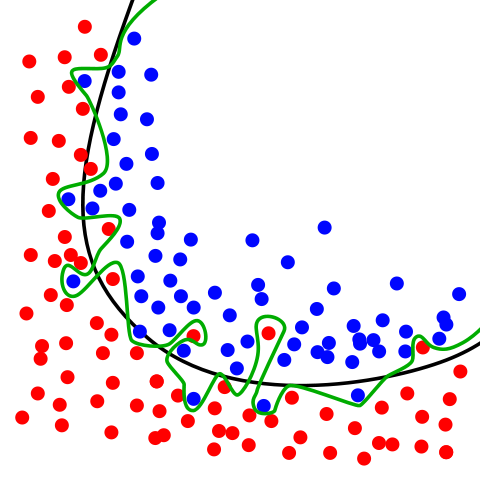

## 过拟合

B站视频：https://www.bilibili.com/video/av43461375/

训练数据集中可能存在一些误差的数据，如果一味追求减少loss，会导致训练的结果过度拟合训练集，即训练时把随机误差因素也认为是深度学习本身的一部分因素。

比如，一个二次曲线被用高次拟合，虽然loss较小，但是在新的数据上效果不好，即泛化能力不好。



对应的概念叫欠拟合，拟合能力太弱无法满足要求。


参考：

- https://github.com/gdyshi/overfitting
- https://blog.csdn.net/guotong1988/article/details/50484632

### 解决

- 增加数据量
- 降低模型复杂度
- 提前终止：避免训练过度

#### 正则化Regularization

为了降低模型的复杂度，在代价函数中加上一项表示模型复杂度的内容，即$\frac \lambda n \sum\limits_{w} |w|$（L1正则项）或者$\frac \lambda {2n} \sum\limits_{w} w^2$（L2正则项）

实现：

- 正则项的产生直接使用`tf.contrib.layers.l2_regularizer(lambd)(var)`，其中var表示你需要计算正则项的Variable，lambd表示正则项中的$\lambda$。
- 之后可以把所有的权重项和普通的loss相加，也可以直接用`tf.add_to_collection('losses', node)`来把他们全部加入losses集合中，最后用`tf.add_n`来加起来
  - tf中的collection操作除了add_to_collection之外，还有get_collection以及clear_collection

参考

- https://www.cnblogs.com/hellcat/p/9474393.html
- https://www.jianshu.com/p/db8ca931026a

#### dropout

反向传播时随机选择一部分权值不更新，相当于随机删除了一部分隐藏层元素。

实现：`tf.nn.dropout(hidden_L1, 保留率)`，保留率为1相当于没有dropout。

参考：

- https://blog.csdn.net/u014696921/article/details/54410166

## 代码实现

仍然使用上一讲的mnist的代码，进行如下修改：

- 加上dropout
- 加上L2正则项
- 修改为使用`tf.nn.softmax_cross_entropy_with_logits`

*注：仅为了示范用法，并不是最优的参数*


```python
import tensorflow as tf
from tensorflow.examples.tutorials.mnist import input_data

mnist = input_data.read_data_sets('MNIST_data', one_hot=True)

def add_layer(inputs, in_size, out_size, activation_function=None):
    Weights = tf.Variable(tf.random_normal([in_size, out_size]))
    Weights_L2 = tf.contrib.layers.l2_regularizer(lambd)(Weights)
    tf.add_to_collection('losses', Weights_L2)
    biases = tf.Variable(tf.zeros([1, out_size]) + 0.1)
    Wx_plus_b = tf.matmul(inputs, Weights) + biases
    if activation_function is None:
        outputs = Wx_plus_b
    else:
        outputs = activation_function(Wx_plus_b)
    return outputs

def compute_accuracy(v_xs, v_ys):
    global prediction
    y_pre = sess.run(prediction, feed_dict={xs: v_xs, keep_rate: 1})
    correct_prediction = tf.equal(tf.argmax(y_pre,1), tf.argmax(v_ys,1))
    accuracy = tf.reduce_mean(tf.cast(correct_prediction, tf.float32))
    result = sess.run(accuracy, feed_dict={xs: v_xs, ys: v_ys})
    return result

tf.get_default_graph().clear_collection('losses')

xs = tf.placeholder(tf.float32, [None, 28 * 28])
ys = tf.placeholder(tf.float32, [None, 10])
lambd = tf.placeholder(tf.float32)
keep_rate = tf.placeholder(tf.float32)

hidden_L1 = add_layer(xs, 28 * 28, 10)
prediction = tf.nn.dropout(hidden_L1, keep_rate)

cross_entropy = tf.nn.softmax_cross_entropy_with_logits(logits=prediction, labels=ys)
loss = cross_entropy + tf.add_n(tf.get_collection('losses'))
train_step = tf.train.GradientDescentOptimizer(0.5).minimize(loss)

with tf.Session() as sess:
    init = tf.global_variables_initializer()
    sess.run(init)

    for i in range(2000):
        batch_xs, batch_ys = mnist.train.next_batch(100)
        sess.run(train_step, feed_dict={xs: batch_xs, ys: batch_ys, lambd: 0.0001, 
                                        keep_rate: 0.95})
        if i % 100 == 0:
            print(compute_accuracy(mnist.test.images, mnist.test.labels))
```

    Extracting MNIST_data\train-images-idx3-ubyte.gz
    Extracting MNIST_data\train-labels-idx1-ubyte.gz
    Extracting MNIST_data\t10k-images-idx3-ubyte.gz
    Extracting MNIST_data\t10k-labels-idx1-ubyte.gz
    0.1544
    0.8595
    0.7081
    0.84
    0.7693
    0.8034
    0.8751
    0.778
    0.7692
    0.5519
    0.8433
    0.7991
    0.7905
    0.7879
    0.8186
    0.8179
    0.7994
    0.8444
    0.8608
    0.8636
    


```python

```
