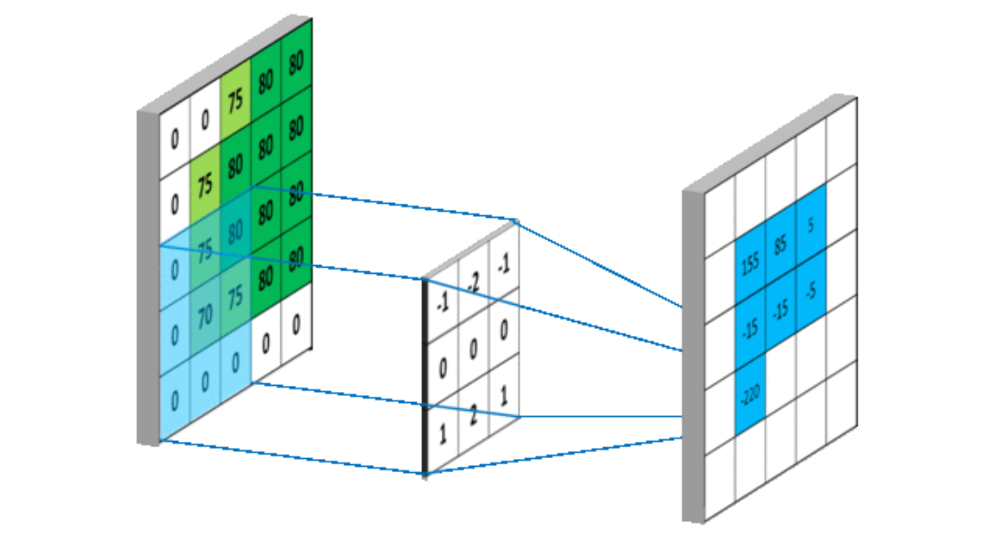
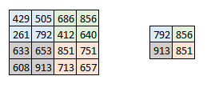

## 卷积神经网络CNN

`convolution`代表卷积，CNN就是卷积神经网络的缩写。

使用特殊的卷积层和池化层来构建网络，进而得到输入数据的某些特征。

### 卷积`convolution`

卷积是一种数学运算，定义为$\displaystyle (f*g)(n)=\int _{-\infty }^{\infty }f(\tau )g(n-\tau )d\tau$，离散情况下定义为$\displaystyle (f*g)(n)=\sum _{\tau =-\infty }^{\infty }{f(\tau )g(n-\tau )}$，也就是求所有的和为$n$的两个数的组合，把这些数组中的两个元素分别用$f$和$g$两个函数作用，求其乘积之和。

具体可以参考https://www.zhihu.com/question/22298352/answer/228543288

其中有一种“卷”的操作，也就是把两个函数卷到了一起。

我们已有的输入，可以作为其中的一个函数，另一个函数就是我们所说的`卷积核`。而函数里面的$n$，是新的函数中的变量。也就是说，从两个函数创建出一个新的函数，这个新的函数就是卷积。



卷积对应的运算就是这个样子，中间的不动的是卷积核。

其实本质上就是把一个范围内的特征提取出来。

### 池化`pooling`

池化就是为了削减数据量，提取其中有意义的信息。

一定范围内的数据进行处理，比如把这个范围内的最大值取出，平均值取出。



可以起到如下作用：

- 大大降低特征的维数，避免过拟合
- 可去除一些冗余信息，得到一个低分辨率的特征图
- 使得模型更关注是否存在某些特征而不是特征的具体位置，可以容忍一些特征微小的位移

参考：

- https://blog.csdn.net/fontthrone/article/details/76652762
- https://blog.csdn.net/mzpmzk/article/details/78636184

## 代码实现

### 卷积

卷积直接可以使用`tf.layers.conv2d`或者`tf.nn.conv2d`进行操作。

前者的参数：

``` python
tf.layers.conv2d(
    inputs,
    filters,     # 卷积核个数
    kernel_size,  # 卷积核大小，如[5，5]。如果长宽相等，也可以直接设置为一个数，如kernel_size=5
    strides=(1, 1), # 卷积过程中的滑动步长，默认为[1,1]. 也可以直接设置为一个数，如strides=2
    padding='valid',  # 边缘填充，'same' 和'valid‘选其一，"valid" 表示不够卷积核大小的块就丢弃，"same"表示不够卷积核大小的块就补0。
    data_format='channels_last',  # 输入数据格式，默认为channels_last ，即 (batch, height, width, channels),也可以设置为channels_first 对应 (batch, channels, height, width)
    dilation_rate=(1, 1),
    activation=None,
    use_bias=True,
    kernel_initializer=None,
    bias_initializer=tf.zeros_initializer(),
    kernel_regularizer=None,
    bias_regularizer=None,
    activity_regularizer=None,
    trainable=True,  # 表明该层的参数是否参与训练
    name=None,
    reuse=None
)

# 例子：
conv1 = tf.layers.conv2d(batch_images, 
                         filters=64,
                         kernel_size=7,
                         strides=2,
                         activation=tf.nn.relu,
                         kernel_initializer=tf.TruncatedNormal(stddev=0.01)
                         bias_initializer=tf.Constant(0.1),
                         kernel_regularizer=tf.contrib.layers.l2_regularizer(0.003),
                         bias_regularizer=tf.contrib.layers.l2_regularizer(0.003),
                         name='conv1')
```

后者的参数：

``` python
tf.nn.conv2d(
    input,  # 一个4维Tensor（N,H,W,C)
    filter,
    strides,
    padding,
    use_cudnn_on_gpu=None,
    data_format=None,  # 可选项，指定输入数据的格式: "NHWC"或 "NCHW"， 默认为"NHWC"。NHWC格式指[batch, in_height, in_width, in_channels]；NCHW格式指[batch, in_channels, in_height, in_width]
    name=None
)
```

参考：

- http://www.cnblogs.com/denny402/p/6932186.html
- https://blog.csdn.net/gqixf/article/details/80519912

### 池化

最大池化：`tf.layers.max_pooling2d`或者`tf.nn.max_pool`，均值池化：`tf.layers.average_pooling2d`或者`tf.nn.avg_pool`。

参数：
``` python
tf.layers.max_pooling2d(
  inputs,
  pool_size, # 池化的核大小
  strides,  # 池化的滑动步长
  padding='valid',
  data_format='channels_last',
  name=None
)

tf.nn.max_pool(
    value, 
    ksize,   # 池化窗口的大小，形状为[1, height, weight, 1]，因为我们不想在batch 和 channels 上做池化，所以这两个维度设为了1
    strides,
    padding, 
    data_format='NHWC', 
    name=None
)
```

参考：

- https://www.jb51.net/article/139009.htm
- https://blog.csdn.net/mzpmzk/article/details/78636184

## 代码示例

依旧使用MNIST进行示例。

*注：若出现：`UnknownError (see above for traceback): Failed to get convolution algorithm. This is probably because cuDNN failed to initialize, so try looking to see if a warning log message was printed above.`，就要考虑 tensorflow版本不对的问题。*

参考：

- https://github.com/MorvanZhou/tutorials/blob/master/tensorflowTUT/tf18_CNN3/full_code.py


```python
import tensorflow as tf
from tensorflow.examples.tutorials.mnist import input_data

mnist = input_data.read_data_sets('MNIST_data', one_hot=True)

def add_layer(inputs, in_size, out_size, activation_function=None):
    # 这里修改了stddev
    Weights = tf.Variable(tf.truncated_normal([in_size, out_size], stddev=0.1))
    biases = tf.Variable(tf.zeros([1, out_size]) + 0.1)
    Wx_plus_b = tf.matmul(inputs, Weights) + biases
    if activation_function is None:
        outputs = Wx_plus_b
    else:
        outputs = activation_function(Wx_plus_b)
    return outputs

def add_conv2d_layer(inputs, input_height, out_size, kernal_size=5, activation_function=None):
    Weights = tf.Variable(tf.truncated_normal([kernal_size, kernal_size, input_height, out_size], stddev=0.1))
    biases = tf.Variable(tf.zeros([out_size]) + 0.1)
    conved = tf.nn.conv2d(inputs, Weights, strides=[1, 1, 1, 1], padding='SAME') + biases
    if activation_function is None:
        outputs = conved
    else:
        outputs = activation_function(conved)
    return outputs

def add_max_pool_layer(inputs, kernal_size=2):
    return tf.nn.max_pool(inputs, ksize=[1, kernal_size, kernal_size, 1], strides=[1, kernal_size, kernal_size, 1], padding='SAME')

def compute_accuracy(v_xs_all, v_ys_all):
    global prediction
    step = 1000
    index = 0
    length = len(v_xs_all) // step * step
    result = 0
    while index < length - 1:
        v_xs = v_xs_all[index:index+step]
        v_ys = v_ys_all[index:index+step]
        y_pre = sess.run(prediction, feed_dict={xs: v_xs, keep_prob: 1})
        correct_prediction = tf.equal(tf.argmax(y_pre,1), tf.argmax(v_ys,1))
        accuracy = tf.reduce_sum(tf.cast(correct_prediction, tf.float32))
        result += sess.run(accuracy, feed_dict={xs: v_xs, ys: v_ys, keep_prob: 1})
        index += step
    return float(result) / length

xs = tf.placeholder(tf.float32, [None, 28 * 28])
ys = tf.placeholder(tf.float32, [None, 10])
keep_prob = tf.placeholder(tf.float32)
x_image = tf.reshape(xs, [-1, 28, 28, 1])

# 经过卷积，形状中长宽不变，结果为?*28*28*32（注意卷积过程中会进行padding操作）
conv1 = add_conv2d_layer(x_image, 1, 32, activation_function=tf.nn.relu)
# 池化后，形状变为?*14*14*32
pool1 = add_max_pool_layer(conv1)
conv2 = add_conv2d_layer(pool1, 32, 64, activation_function=tf.nn.relu)
# 现在形状为?*7*7*64
pool2 = add_max_pool_layer(conv2)

# 添加全连接层，之前先压扁，形状是?*(7*7*64)
flatten = tf.reshape(pool2, [-1, 7*7*64])
inner = add_layer(flatten, 7*7*64, 1024, activation_function=tf.nn.relu)
dropped = tf.nn.dropout(inner, keep_prob)

prediction = add_layer(dropped, 1024, 10, activation_function=tf.nn.softmax)

cross_entropy = tf.reduce_mean(-tf.reduce_sum(ys * tf.log(prediction),
                                              reduction_indices=[1]))
# 使用Adam优化器加速
train_step = tf.train.AdamOptimizer(1e-4).minimize(cross_entropy)

with tf.Session() as sess:
    init = tf.global_variables_initializer()
    sess.run(init)

    for i in range(1001):
        batch_xs, batch_ys = mnist.train.next_batch(100)
        sess.run(train_step, feed_dict={xs: batch_xs, ys: batch_ys, keep_prob: 0.5})
        if i % 50 == 0:
            print(compute_accuracy(mnist.test.images, mnist.test.labels))
```

    Extracting MNIST_data\train-images-idx3-ubyte.gz
    Extracting MNIST_data\train-labels-idx1-ubyte.gz
    Extracting MNIST_data\t10k-images-idx3-ubyte.gz
    Extracting MNIST_data\t10k-labels-idx1-ubyte.gz
    0.1205
    0.7962
    0.8731
    0.908
    0.924
    0.9327
    0.9381
    0.943
    0.9451
    0.9496
    0.954
    0.9516
    0.9569
    0.9593
    0.9621
    0.9625
    0.9662
    0.9666
    0.9664
    0.9676
    0.9694
    


```python

```
